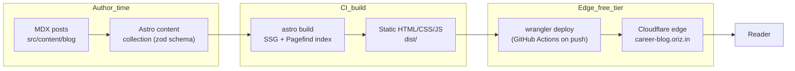

# Ladder — Tech Career Blog

> Honest engineering-career roadmaps — breaking in, levelling up, and navigating the tech job market (India + global).

[](./LICENSE)
[](https://github.com/chirag127/oriz-blog-career/stargazers)
[](https://github.com/chirag127/oriz-blog-career/commits)
[](https://astro.build)

## What it is

**Ladder** is a static blog about building a software / engineering career: how to break in as a fresher, level up as an engineer, and read the market honestly. Posts cover the AI-engineer path, full-stack + cloud roadmaps for India 2026, JEE-to-software transitions, and the SAP fresher track — written from lived experience, not listicle filler.

It exists because most "career advice" is generic and geo-blind. Ladder is opinionated, India-aware, and free.

## Links

- **Live site:** https://career-blog.oriz.in
- **GHP landing:** https://chirag127.github.io/oriz-blog-career/
- **Repo:** https://github.com/chirag127/oriz-blog-career

## ⭐ Star CTA

If this is useful, please ⭐ star the repo — it helps others find it.

## How it flows



## Features

- Astro **content collections** with a strict zod schema (title, description, pubDate, tags, series, canonical, and legacy passthroughs).
- **MDX** posts with math (KaTeX), GitHub-flavoured markdown, syntax highlighting (Shiki / Expressive Code).
- Client-side **Pagefind** search over the built static index — no server, no API key.
- **RSS / Atom / JSON** feeds and an XML sitemap.
- Series, tags, categories, and author pages; per-post reading time.
- Progressive Web App (offline-capable via Workbox / `vite-plugin-pwa`).
- Islands of React for interactive bits (Clerk account UI, embeds) — the rest ships as zero-JS static HTML.

## Tech stack

- **Astro 6** (static output) · **TypeScript**
- **Tailwind CSS v4** (via `@tailwindcss/vite`)
- **MDX** + remark/rehype (gfm, math, slug, KaTeX)
- **React 19** islands · **Pagefind** search · **Motion** animations
- **Biome** (lint/format) · **Vitest** + **Playwright** (unit + e2e)
- **pnpm** package manager · deployed with **Wrangler** to Cloudflare

## Repo structure

```
oriz-blog-career/
├── src/
│   ├── content/
│   │   ├── blog/              # MDX posts (the content collection)
│   │   └── config.ts          # zod schema for the blog collection
│   ├── components/            # blog/, chrome/, embeds/ — UI pieces
│   ├── layouts/               # page + post shells
│   ├── pages/                 # routes: blog/, tags/, categories/, series/, authors/, legal/, account/
│   ├── lib/                   # helpers (feeds, reading time, etc.)
│   ├── i18n/locales/          # translations
│   ├── data/                  # site data
│   └── styles/                # Tailwind + theme
├── astro.config.mjs           # site URL, integrations, redirects
├── package.json               # scripts + deps (pnpm)
├── docs/index.html            # GitHub Pages landing (redirects to live site)
└── .github/workflows/         # deploy.yml — build + publish to Cloudflare
```

## Screenshots

_No screenshot committed yet — see the live site: https://career-blog.oriz.in_

## Quick start

```bash
pnpm install
pnpm dev        # local dev server (astro dev)
pnpm build      # static build → dist/ (astro build)
pnpm preview    # preview the production build
```

Other scripts: `pnpm typecheck` (astro check), `pnpm lint` (biome), `pnpm test` (vitest), `pnpm test:e2e` (playwright).

## Configuration

All client-exposed config uses `PUBLIC_*` env vars (values live in the CI/secrets vault, never in the repo). Names and purpose only:

| Variable | Purpose |
| --- | --- |
| `PUBLIC_CLERK_PUBLISHABLE_KEY` | Clerk publishable key for the account UI island |
| `PUBLIC_ADSENSE_CLIENT` | Google AdSense client id |
| `PUBLIC_GA` | Google Analytics measurement id |
| `PUBLIC_CF_BEACON_TOKEN` | Cloudflare Web Analytics beacon token |
| `PUBLIC_ALGOLIA_APP_ID` | Algolia app id (optional search backend) |
| `PUBLIC_ALGOLIA_SEARCH_KEY` | Algolia search-only key |
| `PUBLIC_ALGOLIA_INDEX_NAME` | Algolia index name |
| `PUBLIC_BUTTONDOWN_USERNAME` | Buttondown newsletter username |
| `PUBLIC_GISCUS_REPO` | Giscus comments repo |
| `PUBLIC_GISCUS_REPO_ID` | Giscus repo id |
| `PUBLIC_GISCUS_CATEGORY` | Giscus discussion category |
| `PUBLIC_GISCUS_CATEGORY_ID` | Giscus category id |
| `PUBLIC_BASE_PATH` | Base path override for the GHP landing |

## Part of the oriz family

One of ~80 sites in the [oriz](https://blog.oriz.in) family — a fleet of small, focused static sites sharing a build mechanism (`@chirag127/*` packages) while each keeps its own identity. Runs at **$0 on the Cloudflare free tier**.

## Contributing

Issues and PRs welcome — typo fixes, corrections, and new post ideas especially. Keep changes small and use conventional commits.

## License

MIT © Chirag Singhal

## Author

Chirag Singhal · chirag@oriz.in

## Status & roadmap

Stable and live. Ongoing: more posts, better cross-linking between sibling oriz blogs.

Conventional commits are the changelog.
